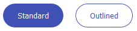

# `mwcpl-button`

## Examples

### Standard


```html
<mwcpl-button label="Standard"></mwcpl-button>
<mwcpl-button uppercase label="Uppercase"></mwcpl-button> 
```

### Outlined


```html
<mwcpl-button outlined label="Outlined"></mwcpl-button>
<mwcpl-button outlined uppercase label="Uppercase"></mwcpl-button>
```

### Rounded



```html
<mwcpl-button rounded label="Standard"></mwcpl-button>
<mwcpl-button outlined rounded label="Outlined"></mwcpl-button>
```

### Leading Icon


```html
<mwcpl-button label="Standard">
    <span slot="leading-icon" class="fas fa-camera"></span>
</mwcpl-button>
<mwcpl-button rounded label="Standard">
    <span slot="leading-icon" class="fas fa-camera"></span>
</mwcpl-button>
<mwcpl-button outlined label="Outlined">
    <span slot="leading-icon" class="fas fa-camera"></span>
</mwcpl-button>
<mwcpl-button outlined rounded label="Outlined">
    <span slot="leading-icon" class="fas fa-camera"></span>
</mwcpl-button>
```

### Trailing Icon


```html
<mwcpl-button label="Standard">
    <span slot="trailing-icon" class="fas fa-long-arrow-alt-right"></span>
</mwcpl-button>
<mwcpl-button rounded label="Standard">
    <span slot="trailing-icon" class="fas fa-long-arrow-alt-right"></span>
</mwcpl-button>
<mwcpl-button outlined label="Outlined">
    <span slot="trailing-icon" class="fas fa-long-arrow-alt-right"></span>
</mwcpl-button>
<mwcpl-button outlined rounded label="Outlined">
    <span slot="trailing-icon" class="fas fa-long-arrow-alt-right"></span>
</mwcpl-button>
```

### Fullwidth


```html
<mwcpl-button fullwidth label="Standard"></mwcpl-button>
```

### Loading


```html
<mwcpl-button loading label="Standard"></mwcpl-button>
<mwcpl-button loading rounded label="Standard"></mwcpl-button>
<mwcpl-button loading outlined label="Outlined"></mwcpl-button>
<mwcpl-button loading outlined rounded label="Outlined"></mwcpl-button>
```

### Disabled


```html
<mwcpl-button disabled label="Standard"></mwcpl-button>
<mwcpl-button disabled rounded label="Standard"></mwcpl-button>
<mwcpl-button disabled outlined label="Outlined"></mwcpl-button>
<mwcpl-button disabled outlined rounded label="Outlined"></mwcpl-button>
```

## API

### Slots

| Name            | Description                            |
| --------------- | -------------------------------------- |
| `leading-icon`  | Icon to be displayed before the label. |
| `trailing-icon` | Icon to be displayed after the label.  |


### Properties

| Property    | Attribute   | Description                           | Type      | Default  |
| ----------- | ----------- | ------------------------------------- | --------- | -------- |
| `disabled`  | `disabled`  | Makes the button non interactive.      | `boolean` | `false`  |
| `fullwidth` | `fullwidth` | Creates a fullwidth button.            | `boolean` | `false`  |
| `label`     | `label`     | Label for the button.                  | `string`  | `''`     |
| `loading`   | `loading`   | Adds a loading indicator.              | `boolean` | `false`  |
| `outlined`  | `outlined`  | Creates an outlined button.            | `boolean` | `false`  |
| `rounded`   | `rounded`   | Creates a button with rounded corners. | `boolean` | `false`  |
| `uppercase` | `uppercase` | Makes the button text uppercase.       | `boolean` | `false`  |

### CSS Custom Properties

| Name                                         | Default        | Description                                    |
| -------------------------------------------- | ------------------- | ----------------------------------------- |
| `--mwcpl-button-padding`                     | `0.75em 1.5em`      | Adds padding to the button.               |
| `--mwcpl-button-border-radius`               | `4px`               | Radius of the button corners.             |
| `--mwcpl-button-color`                       | `#ffffff`           | Color of the button text.                 |
| `--mwcpl-button-background-color`            | `#3f51b5`           | Background fill of the button.            |
| `--mwcpl-button-background-color-hover`      | `#5262bc`           | Background fill of the hovered button.    |
| `--mwcpl-button-background-color-active`     | `#6574c4`           | Background fill of the pressed button.    |
| `--mwcpl-button-background-color-box-shadow` | `0 0 0 2px #d9dcf0` | Sets the box shadow of the button.        |
| `--mwcpl-button-background-color-loading`    | `#d9dcf0`           | Background fill of the loading indicator. |


----------------------------------------------

*Built with [StencilJS](https://stenciljs.com/)*
