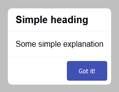
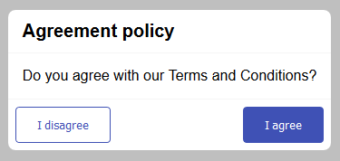
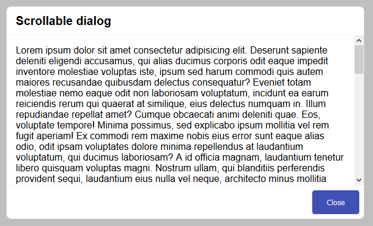

# `mwcpl-dialog`

## Examples

### Simple



```html
<mwcpl-dialog heading="Simple heading">
    <p>Some simple explanation</p>
    <mwcpl-button slot="primary-action" label="Got it!" closeDialog></mwcpl-button>
</mwcpl-dialog>
```

### With Actions



```html
<mwcpl-dialog heading="Agreement policy">
    <p>Do you agree with our Terms and Conditions?</p>
    <mwcpl-button outlined slot="secondary-action" label="I disagree" closeDialog></mwcpl-button>
    <mwcpl-button slot="primary-action" label="I agree" closeDialog></mwcpl-button>
</mwcpl-dialog>
```

### Scrollable



```html
<mwcpl-dialog heading="Scrollable dialog">
    <p>Lorem ipsum dolor ...</p>
    <mwcpl-button slot="primary-action" label="Close" closeDialog></mwcpl-button>
</mwcpl-dialog>
```

### Dissmisable Backdrop

```html
<mwcpl-dialog id="dismissable-dialog" heading="Dismissable dialog" dismissable>
    <p>Click on the backdrop to dismiss the dialog.</p>
    <mwcpl-button slot="primary-action" label="Not working"></mwcpl-button>
</mwcpl-dialog>
```

## API

### Slots

| Name               | Description                     |
| ------------------ | ------------------------------- |
| `default`          | Content of the dialog.          |
| `secondary-action` | Action positioned to the left.  |
| `primary-action`   | Action positioned to the right. |

### Properties

| Property      | Attribute     | Description                                       | Type      | Default  |
| ------------- | ------------- | ------------------------------------------------- | --------- | -------- |
| `dismissable` | `dismissable` | Dismisses the dialog by clicking on the backdrop. | `boolean` | `false`  |
| `heading`     | `heading`     | The title of the dialog.                          | `string`  | `''`     |
| `open`        | `open`        | Controls the visibility of the dialog.            | `boolean` | `false`  |

### Slot Element Properties

| Property      | Attribute     | Description                                                                   |
| ------------- | ------------- | ----------------------------------------------------------------------------- |
| `closeDialog` | `closeDialog` | Clicked element in the `*-action` slot with this attribute closes the dialog. | 

### CSS Custom Properties

| Name                               | Default              | Description                                 |
| ---------------------------------- | -------------------- | ------------------------------------------- |
| `--mwcpl-dialog-backdrop-color`    | `rgba(0, 0, 0, .25)` | Background fill of the dialog backdrop.     |
| `--mwcpl-dialog-max-width`         | `600px`              | Maximum dialog width.                       |
| `--mwcpl-dialog-background-color`  | `#ffffff`            | Background fill of the dialog.              |
| `--mwcpl-dialog-color`             | `#000000`            | Color of the dialog text.                   |
| `--mwcpl-dialog-border-color`      | `#f5f5f5`            | Top and bottom border color of the content. |

----------------------------------------------

*Built with [StencilJS](https://stenciljs.com/)*
