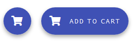
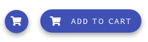

# `mwcpl-fab`

## Examples

### Standard



```html
<mwcpl-fab>
    <span slot="icon" class="fas fa-shopping-cart"></span>
</mwcpl-fab>
<mwcpl-fab label="Add to cart">
    <span slot="icon" class="fas fa-shopping-cart"></span>
</mwcpl-fab>
```

### Mini



```html
<mwcpl-fab mini>
    <span slot="icon" class="fas fa-shopping-cart"></span>
</mwcpl-fab>
<mwcpl-fab mini label="Add to cart">
    <span slot="icon" class="fas fa-shopping-cart"></span>
</mwcpl-fab>
```

## API

### Slots

| Name   | Description                                                                              |
| ------ | ---------------------------------------------------------------------------------------- |
| `icon` | Icon of the floating action button. It is positioned before the text if text is present. |


### Properties

| Property | Attribute | Description            | Type      | Default  |
| -------- | --------- | ---------------------- | --------- | -------- |
| `label`  | `label`   | Label for the FAB.     | `string`  | `''`     |
| `mini`   | `mini`    | Creates a smaller FAB. | `boolean` | `false`  |

### CSS Custom Properties

| Name                                  | Default   | Description                          |
| --------------------------------------| --------- | ------------------------------------ |
| `--mwcpl-fab-color`                   | `#ffffff` | Color of the icon and the text.      |
| `--mwcpl-fab-background-color`        | `#3f51b5` | Background fill of the FAB.          |
| `--mwcpl-fab-background-color-hover`  | `#5262bc` | Background fill of the hovered FAB.  |
| `--mwcpl-fab-background-color-active` | `#6574c4` | Background fill of the pressed FAB.  |


----------------------------------------------

*Built with [StencilJS](https://stenciljs.com/)*
