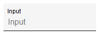
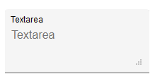
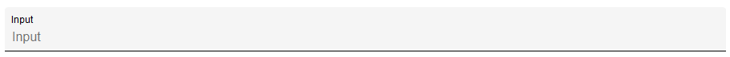
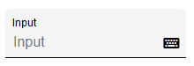
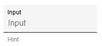

# `mwcpl-form-field`

## Examples

### Input



```html
<mwcpl-form-field label="Input">
    <input slot="input" type="text" placeholder="Input">
</mwcpl-form-field>
```

### Textarea



```html
<mwcpl-form-field label="Textarea">
    <textarea slot="input" placeholder="Textarea"></textarea>
</mwcpl-form-field>
```

### Fullwidth



```html
<mwcpl-form-field label="Input" fullwidth>
    <input slot="input" type="text" placeholder="Input">
</mwcpl-form-field>
```

### With Icon



```html
<mwcpl-form-field label="Input">
    <input slot="input" type="text" placeholder="Input">
    <span slot="icon" class="fas fa-keyboard"></span>
</mwcpl-form-field>
```

### With hint



```html
<mwcpl-form-field label="Input">
    <input slot="input" type="text" placeholder="Input">
    <span slot="hint">Hint</span>
</mwcpl-form-field>
```

## API

### Slots

| Name    | Description                                                |
| ------- | ---------------------------------------------------------- |
| `icon`  | Icon to be displayed after the `input` slot.               |
| `input` | Expects `<input>` or `<textarea>` element.                 |
| `hint`  | A hint or an error message displayed below the form field. |


### Properties

| Property    | Attribute   | Description                     | Type      | Default |
| ----------- | ----------- | ------------------------------- | --------- | ------- |
| `fullwidth` | `fullwidth` | Creates a fullwidth form field. | `boolean` | `false` |
| `label`     | `label`     | Label for the form field.       | `string`  | `''`    |

### CSS Custom Properties

| Name                                  | Default   | Description                               |
| ------------------------------------- | ----------| ----------------------------------------- |
| `--mwcpl-form-field-background-color` | `#f5f5f5` | Background fill of the form field.        |
| `--mwcpl-form-field-border-radius`    | `4px`     | Radius of the form field corners.         |
| `--mwcpl-form-field-color`            | `#000000` | Color of the form field text.             |
| `--mwcpl-form-field-color-active`     | `#3f51b5` | Background fill of the active form field. |
| `--mwcpl-form-field-hint-color`       | `#808080` | Color of the hint text.                   |

----------------------------------------------

*Built with [StencilJS](https://stenciljs.com/)*
