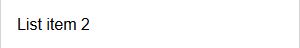
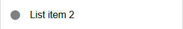
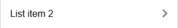

# `mwcpl-list-item`

Sub-element of [`mwcpl-list`](https://github.com/zanozbot/mwcpl/tree/master/src/components/mwcpl-list).

## Examples

## Standard



```html
<mwcpl-list-item>List item 2</mwcpl-list-item>
```

## Leading Icon



```html
<mwcpl-list-item>
    <span slot="leading-icon" class="fas fa-circle"></span>
    <span>List item 2</span>
</mwcpl-list-item>
```

## Trailing Icon



```html
<mwcpl-list-item>
    <span slot="trailing-icon" class="fas fa-chevron-right"></span>
    <span>List item 2</span>
</mwcpl-list-item>
```

## API

### Slots

| Name            | Decription                            |
| --------------- | ------------------------------------- |
| `leading-icon`  | Icon to be displayed before the text. |
| `trailing-icon` | Icon to be displayed after the text.  |

### Properties

No properties.

### CSS Custom Properties

| Name                                        | Default   | Description                                         |
| ------------------------------------------- | --------- | --------------------------------------------------- |
| `--mwcpl-list-item-color`                   | `#000000` | Color of the text.                                  |
| `--mwcpl-list-item-background-color`        | `#ffffff` | Background fill of the list item.                   |
| `--mwcpl-list-item-background-color-hover`  | `#f5f5f5` | Background fill of the clickable hovered list item. |
| `--mwcpl-list-item-background-color-active` | `#e9e9e9` | Background fill of the clickable pressed list item. |
| `--mwcpl-list-item-leading-icon-color`      | `#808080` | Color of the leading icon.                          |
| `--mwcpl-list-item-trailing-icon-color`     | `#f5f5f5` | Color of the trailing icon.                         |

----------------------------------------------

*Built with [StencilJS](https://stenciljs.com/)*
