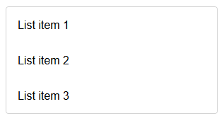
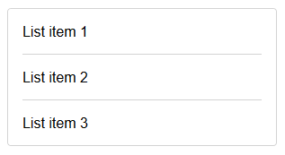
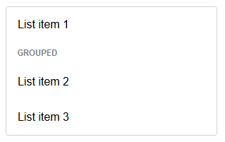
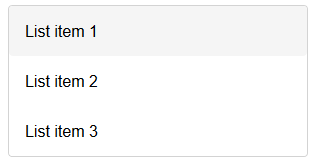

# `mwcpl-list`

Navigate to [`mwcpl-list-item`](https://github.com/zanozbot/mwcpl/tree/master/src/components/mwcpl-list-item) for additional examples and customization.

## Examples

### Standard



```html
<mwcpl-list>
    <mwcpl-list-item>List item 1</mwcpl-list-item>
    <mwcpl-list-item>List item 2</mwcpl-list-item>
    <mwcpl-list-item>List item 3</mwcpl-list-item>
</mwcpl-list>
```

### Separated



```html
<mwcpl-list>
    <mwcpl-list-item>List item 1</mwcpl-list-item>
    <li role="separator"></li>
    <mwcpl-list-item>List item 2</mwcpl-list-item>
    <li role="separator"></li>
    <mwcpl-list-item>List item 3</mwcpl-list-item>
</mwcpl-list>
```

### Grouped



```html
<mwcpl-list>
    <mwcpl-list-item>List item 1</mwcpl-list-item>
    <li role="separator" group>Grouped</li>
    <mwcpl-list-item>List item 2</mwcpl-list-item>
    <mwcpl-list-item>List item 3</mwcpl-list-item>
</mwcpl-list>
```

### Clickable



```html
<mwcpl-list clickable>
    <mwcpl-list-item>List item 1</mwcpl-list-item>
    <mwcpl-list-item>List item 2</mwcpl-list-item>
    <mwcpl-list-item>List item 3</mwcpl-list-item>
</mwcpl-list>
```

## API

### Slots

| Name               | Description                                                                                                                                                                             |
| ------------------ | --------------------------------------------------------------------------------------------------------------------------------------------------------------------------------------- |
| `default`          | Expects [`mwcpl-list-item`](https://github.com/zanozbot/mwcpl/tree/master/src/components/mwcpl-list-item), `<li role="separator"></li>` or `<li role="separator" group></li>` elements. |

### Properties

| Property    | Attribute   | Description               | Type      | Default |
| ----------- | ----------- | ------------------------- | --------- | ------- |
| `clickable` | `clickable` | Makes the list clickable. | `boolean` | `false` |

### CSS Custom Properties

| Name                         | Default   | Description                   |
| ---------------------------- | --------- | ----------------------------- |
| `--mwcpl-list-border-color`  | `#d3d3d3` | Border color of the list.     |
| `--mwcpl-list-border-radius` | `4px`     | Radius of the list corners.   |
| `--mwcpl-list-group-color`   | `#808080` | Color of the group separator. |

----------------------------------------------

*Built with [StencilJS](https://stenciljs.com/)*
