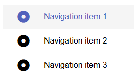
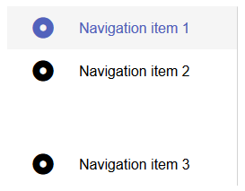
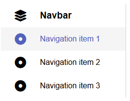
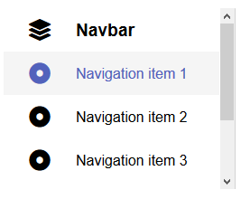

# `mwcpl-navbar`

Navigate to [`mwcpl-navbar-item`](https://github.com/zanozbot/mwcpl/tree/master/src/components/mwcpl-navbar-item) for additional customization.

## Examples

### Standard



```html
<mwcpl-navbar>
    <mwcpl-navbar-item label="Navigation item 1" href="#">
        <span slot="icon" class="fas fa-dot-circle"></span>
    </mwcpl-navbar-item>
    <mwcpl-navbar-item label="Navigation item 2" href="#">
        <span slot="icon" class="fas fa-dot-circle"></span>
    </mwcpl-navbar-item>
    <mwcpl-navbar-item label="Navigation item 3" href="#">
        <span slot="icon" class="fas fa-dot-circle"></span>
    </mwcpl-navbar-item>
</mwcpl-navbar>
```

### Spaced



```html
<mwcpl-navbar id="navbar-spaced">
    <mwcpl-navbar-item label="Navigation item 1" href="#">
        <span slot="icon" class="fas fa-dot-circle"></span>
    </mwcpl-navbar-item>
    <mwcpl-navbar-item label="Navigation item 2" href="#">
        <span slot="icon" class="fas fa-dot-circle"></span>
    </mwcpl-navbar-item>
    <mwcpl-navbar-item spacer label="Navigation item 3" href="#">
        <span slot="icon" class="fas fa-dot-circle"></span>
    </mwcpl-navbar-item>
</mwcpl-navbar>
```

### Header



```html
<mwcpl-navbar>
    <mwcpl-navbar-item header label="Navbar" href="#">
        <span slot="icon" class="fas fa-layer-group"></span>
    </mwcpl-navbar-item>
    <mwcpl-navbar-item label="Navigation item 1" href="#">
        <span slot="icon" class="fas fa-dot-circle"></span>
    </mwcpl-navbar-item>
    <mwcpl-navbar-item label="Navigation item 2" href="#">
        <span slot="icon" class="fas fa-dot-circle"></span>
    </mwcpl-navbar-item>
    <mwcpl-navbar-item label="Navigation item 3" href="#">
        <span slot="icon" class="fas fa-dot-circle"></span>
    </mwcpl-navbar-item>
</mwcpl-navbar>
```

### Scrollable



```html
<mwcpl-navbar style="height: 300px">
    <mwcpl-navbar-item header label="Navbar" href="#">
        <span slot="icon" class="fas fa-layer-group"></span>
    </mwcpl-navbar-item>
    <mwcpl-navbar-item label="Navigation item 1" href="#">
        <span slot="icon" class="fas fa-dot-circle"></span>
    </mwcpl-navbar-item>
    <mwcpl-navbar-item label="Navigation item 2" href="#">
        <span slot="icon" class="fas fa-dot-circle"></span>
    </mwcpl-navbar-item>
    <mwcpl-navbar-item label="Navigation item 3" href="#">
        <span slot="icon" class="fas fa-dot-circle"></span>
    </mwcpl-navbar-item>
    <mwcpl-navbar-item label="Navigation item 4" href="#">
        <span slot="icon" class="fas fa-dot-circle"></span>
    </mwcpl-navbar-item>
    <mwcpl-navbar-item label="Navigation item 5" href="#">
        <span slot="icon" class="fas fa-dot-circle"></span>
    </mwcpl-navbar-item>
</mwcpl-navbar>
```

## API

### Slots

| Name      | Description                                                                                                           |
| --------- | --------------------------------------------------------------------------------------------------------------------- |
| `default` | Expects Expects [`mwcpl-navbar-item`](https://github.com/zanozbot/mwcpl/tree/master/src/components/mwcpl-navbar-item) |

### Properties

| Property | Attribute | Description                     | Type      | Default |
| -------- | --------- | ------------------------------- | --------- | ------- |
| `fixed`  | `fixed`   | Creates a fixed navigation bar. | `boolean` | `false` |

\* Fixed navigation bar occupies `5rem` of width on screens >= 600px. Therefore, a `margin-left` of `5rem` or similar should be added to the body or content. <br>
\*\* On screens < 600px navigation bar occupies `3rem` of height. Therefore, a `margin-bottom` of `3rem` or similar should be added to the body or content.

### CSS Custom Properties

| Name                              | Default            | Description                             |
| --------------------------------- | ------------------ | --------------------------------------- |
| `--mwcpl-navbar-background-color` | `#ffffff`          | Background fill of the navigation.      |
| `--mwcpl-navbar-shadow`           | `1px 0 0 #d3d3d3`  | Shadow of the navigation bar.           |
| `--mwcpl-navbar-shadow-mobile`    | `0 -1px 0 #d3d3d3` | Shadow of the navigation bar on mobile. |

----------------------------------------------

*Built with [StencilJS](https://stenciljs.com/)*
