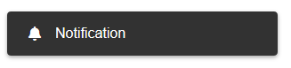
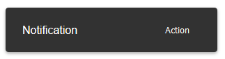

# `mwcpl-notification`

## Examples

### Standard


```html
<mwcpl-notification show label="Notification"></mwcpl-notification>
```

### With Icon



```html
<mwcpl-notification show label="Notification">
    <span slot="icon" class="fas fa-bell"></span>
</mwcpl-notification>
```

### With Action



```html
<mwcpl-notification show label="Notification">
    <mwcpl-button closeNotification slot="action" label="Action"></mwcpl-button>
</mwcpl-notification>
```

## API

### Slots

| Name     | Description                                                |
| -------- | ---------------------------------------------------------- |
| `icon`   | Icon to be displayed before the text.                      |
| `action` | Notification action displayed after the notification text. |

## Properties

| Property | Attribute | Description                     | Type      | Default |
| -------- | --------- | ------------------------------- | --------- | ------- |
| `label`  | `label`   | The text of the notification.   | `string`  | `''`    |
| `show`   | `show`    | Makes the notification visible. | `boolean` | `false` |

### Slot Element Properties

| Property            | Attribute           | Description                                                                          |
| ------------------- | ------------------- | ------------------------------------------------------------------------------------ |
| `closeNotification` | `closeNotification` | Clicked element in the `action` slot with this attribute dismisses the notification. | 

### CSS Custom Properties

| Name                                                  | Default                               | Description                                              |
| ----------------------------------------------------- | ------------------------------------- | -------------------------------------------------------- |
| `--mwcpl-notification-background-color`               | `#323232`                             | Background fill of the notification.                     |
| `--mwcpl-notification-color`                          | `#ffffff`                             | Color of the text.                                       |
| `--mwcpl-notification-min-width`                      | `16rem`                               | Mininum width of the notification.                       |
| `--mwcpl-notification-border-radius`                  | `4px`                                 | Radius of the notification corners.                      |
| `--mwcpl-notification-box-shadow`                     | `0px 2px 4px 0px rgba(0, 0, 0, 0.35)` | Shadow of the notification.                              |
| `--mwcpl-notification-action-background-color`        | `transparent`                         | Background fill of the notification action.              |
| `--mwcpl-notification-action-background-color-active` | `rgba(255, 255, 255, .2)`             | Background fill of the notification action when pressed. |
| `--mwcpl-notification-action-background-color-hover`  | `rgba(255, 255, 255, .3)`             | Background fill of the notification action on hover.     |

----------------------------------------------

*Built with [StencilJS](https://stenciljs.com/)*
