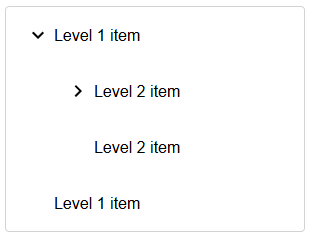
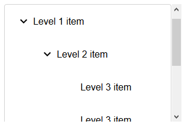

# `mwcpl-tree-view`

Navigate to [`mwcpl-tree-view-item`](https://github.com/zanozbot/mwcpl/tree/master/src/components/mwcpl-tree-view-item) for additional customization.

## Examples

### Standard



```html
<mwcpl-tree-view>
    <mwcpl-tree-view-item label="Level 1 item">
        <mwcpl-tree-view-item label="Level 2 item">
        <mwcpl-tree-view-item label="Level 3 item"></mwcpl-tree-view-item>
        <mwcpl-tree-view-item label="Level 3 item"></mwcpl-tree-view-item>
        </mwcpl-tree-view-item>
        <mwcpl-tree-view-item label="Level 2 item"></mwcpl-tree-view-item>
    </mwcpl-tree-view-item>
    <mwcpl-tree-view-item label="Level 1 item"></mwcpl-tree-view-item>
</mwcpl-tree-view>
```

### Scrollable



```html
<mwcpl-tree-view style="height: 200px">
    <mwcpl-tree-view-item open label="Level 1 item">
        <mwcpl-tree-view-item open label="Level 2 item">
        <mwcpl-tree-view-item label="Level 3 item"></mwcpl-tree-view-item>
        <mwcpl-tree-view-item label="Level 3 item"></mwcpl-tree-view-item>
        </mwcpl-tree-view-item>
        <mwcpl-tree-view-item label="Level 2 item"></mwcpl-tree-view-item>
    </mwcpl-tree-view-item>
    <mwcpl-tree-view-item label="Level 1 item"></mwcpl-tree-view-item>
</mwcpl-tree-view>
```

## API

### Slots

| Name      | Description                                                                                                                  |
| --------- | ---------------------------------------------------------------------------------------------------------------------------- |
| `default` | Expects [`mwcpl-tree-view-item`](https://github.com/zanozbot/mwcpl/tree/master/src/components/mwcpl-tree-view-item) element. |

## Properties

No properties.

### CSS Custom Properties

| Name                                 | Default   | Description                       |
| ------------------------------------ | --------- | --------------------------------- |
| `--mwcpl-tree-view-background-color` | `#ffffff` | Background fill of the tree view. | 
| `--mwcpl-tree-view-border-radius`    | `4px`     | Radius of tree view corners.      |
| `--mwcpl-tree-view-color`            | `#000000` | Color of the text and icons.      |
| `--mwcpl-tree-view-border-color`     | `#d3d3d3` | Border color of the tree view.    |


----------------------------------------------

*Built with [StencilJS](https://stenciljs.com/)*
